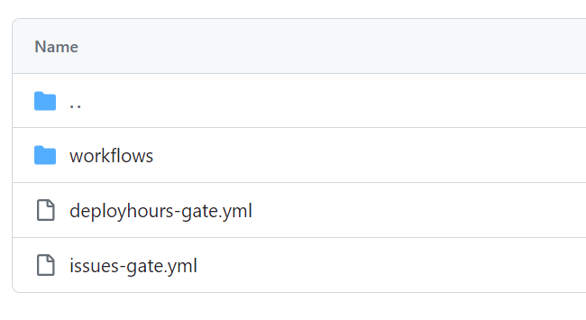

# Configuring the Gate(s)

## Protection Rule Configuration

Now you need to add a protection rule on the repositor(y/ies), for that you create or edit existing repository environments and add the protection rule to the environment(s) you want to protect.


The detailed steps are described in the [GitHub documentation](https://docs.github.com/en/actions/deployment/protecting-deployments/configuring-custom-deployment-protection-rules).

## Gate Configuration

In order to configure the gates you need to store a YAML file with the gate rules in the repository. The file must be stored in the `.github` folder in the repository root. The name of the file depends on the gate.



> **Warning** If the configuration file doesn't exist the gate will reject the deployment.

> **NOTE** The configuration file is always read from the HEAD of the default branch.

### Deploy Gates

The deploy gates are configured in the file `.github/deployhours-gate.yml`, the file contains the following attributes:

- `Lockout` (optional. Boolean). If the repository is in lockout mode the gate will reject all deployments, otherwise the rules will be evaluated.
- `DeployDays` (optional. Array of strings). The days of the week when deployments are allowed. If no value is then `["Monday","Tuesday", "Wednesday", "Thursday", "Friday"]` will be used by default.
- `Rules` (mandatory. Array of objects). The rules to evaluate (order is not important). Each rule has the following attributes:
  -  `Environment` (mandatory. String). The name of the environment to evaluate the rule,if left empty the rule will be evaluated for all environments (unless a specific rule for the environment is found)
  -  `DeploySlots` (mandatory. Array of objects). Time Slots in which deploys are allowed (at least one). Each slot has the following attributes:
     - `Start` (mandatory. String). The start time of the slot
     - `End` (mandatory. String). The end time of the slot.

The times are in the format `HH:mm:ss` (24 hour format defined in UTC). Seconds can be skipped.

> **Warning** Do not use 24:00 as the end time, use 23:59 instead.

Example of a configuration file 
```yaml
# Are we currently in a lockout? This will reject any deployment regardless of all other conditions
Lockout: false

# Valid Days
# "Monday","Tuesday", "Wednesday", "Thursday", "Friday", "Saturday","Sunday"
# Only needed if you want to override default value
# Default: (monday through friday)
DeployDays: ["Monday","Tuesday", "Wednesday", "Thursday", "Friday","Saturday", "Sunday"]

Rules:
# Leave environment value empty so the rule applies to any environment (if no match for a specific environment is found)
# Times are in UTC (24H)
- Environment: # This will apply to all environments but production since it has a specific rule
  DeploySlots:
    - Start: 08:00
      End:  10:15
    - Start: 15:00
      End:  17:30
    - Start: 18:00
      End:  23:59
- Environment: production
  DeploySlots:
    - Start: 08:00
      End:  12:10
```

### Issue Gates

The issues gates are configured in the file `.github/issues-gate.yml`, the file contains the following attributes:

- `Rules` (mandatory. Array of objects). The rules to evaluate (order is not important). Each rule has the following attributes:
  -  `Environment` (mandatory. String). The name of the environment to evaluate the rule,if left empty the rule will be evaluated for all environments (unless a specific rule for the environment is found), each rule can have three attributes:
  -  `WaitMinutes` (optional. Integer). The number of minutes to wait before evaluating the rule. If omitted the rule will be evaluated immediately.
  -  `Search` See [Configuration for Search](#configuration-for-search)
  -  `Issues` See [Configuration for Issues](#configuration-for-issues)

You can configure either `Search` or `Issues` or both. If you configure both the gate will evaluate both rules and if any of them fails the deployment will be rejected (issues are evaluated first)

#### Configuration for Search

The search performed a search just like you would perform on the GitHub UI. Although you can search for any item on GitHub this capability restricts the search to issues.

Use only search if `Issues` is not enough for your needs.

For more information read the [GitHub documentation](https://docs.github.com/en/search-github/getting-started-with-searching-on-github/about-searching-on-github) on search.

The search has the following attributes:

- `MaxAllowed` (mandatory. Integer). The maximum number of issues allowed to be found by the search. If the number of issues found is greater than this value the gate will reject the deployment.
- `Message` (optional. String). The message to display when the gate rejects the deployment. If ommited the message will be `You have $NRISSUES issues, this exceeds maximum number $MaxAllowed in configured $LINKTOSEARCHINUI.`
- `Query` (mandatory. String). The query to perform. The query is the same as the one you would perform on the GitHub UI.	
- `OnlyCreatedBeforeWorkflowCreated` (optional. Boolean). If true only issues created before the workflow run was started will be considered. If false all issues will be considered.

> **NOTE** Make sure you either include the repo or the organization in the query otherwise the search will be made on entire GitHub.

> **Warning** Search is a more expensive call and has a very low rate limit. Use it wisely.

#### Configuration for Issues

The configuration for issues has the following attributes:

- `MaxAllowed` (mandatory. Integer). The maximum number of issues allowed to be found by the search. If the number of issues found is greater than this value the gate will reject the deployment.
- `Message` (optional. String). The message to display when the gate rejects the deployment. If ommited the message will be `You have $NRISSUES issues, this exceeds maximum number $MaxAllowed in configured query.`
- `State` (Optional. String). The state of the issues to consider. Valid values are `OPEN`, `CLOSED` and `ALL`.
- `Repo` (Optional. String). The repository to search for issues. If omitted the current repository will be used. If specified it must be in the format `owner/repo` and the gate has to be installed on that repository.
- `Assignee` (Optional. String). The user to search for issues assigned to. If omitted assignee(s) are not relevant.
- `Author` (Optional. String). The user to search for issues created by. If omitted author is not relevant.
- `Mention` (Optional. String). The user or team to search for issues mentioned in. If omitted mention is not relevant.
- `Milestone` (Optional. Integer). The milestone **number** (not name) to search for issues in. 
  - If omitted milestone is not relevant, issues with or without a milestone will be considered.
  - Use `*` issues that have any milestone set.
  - Leave blank to search for issues with no milestone.
- `Labels` (Optional. Array of strings). The labels to search for issues with. If omitted labels are not relevant.
- `OnlyCreatedBeforeWorkflowCreated` (optional. Boolean). If true only issues created before the workflow run was started will be considered. If false all issues will be considered.

#### Sample Configuration File

Sample configuration file with all the options:

```yaml
Rules:
# Leave environment value empty so the rule applies to any environment (if no match for a specific environment is found)
- Environment:
  # Search is more expensive and has a very low rate limit. Use wisely.
  Search:
    MaxAllowed: 5
    # Message: You have too many open show stoppers # (optional)
    Query: 'is:open repo:mona/lisa label:show-stopper'
    OnlyCreatedBeforeWorkflowCreated: true

# Local env
- Environment: production
  # Time to wait until the gate is evaluated
  # WaitMinutes: 5
  Issues:
    MaxAllowed: 0
    # Message: You have too many open show stopper bugs # (optional)    
    State: "OPEN"
    # Repo:  # If omitted current repo will be used
    # Assignee: ""
    # Author: ""
    # Mention: ""
    # Skip Milestone parameter or * for any milestone, value for a specific milestone (NUMBER not label) 
    # Milestone: "1" # Milestone number (not label)
    Labels:
      - BUG
      - show-stopper
    OnlyCreatedBeforeWorkflowCreated: true
```
