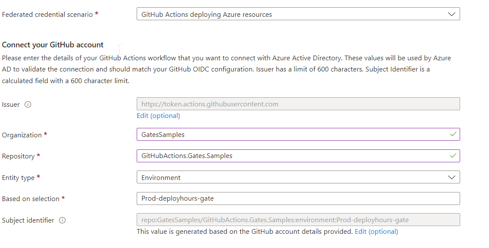
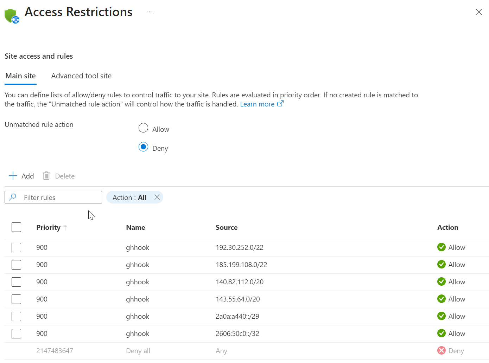

# Installation Guide

This guide will walk you through the steps required to install the gate(s) from your GitHub repository.

You will have to create one app for each of the gates you want to install.

## Configuring a GitHub App

Before proceeding with the installation, you need to create a GitHub App. The GitHub App will be used to authenticate the gates and to provide the required permissions to the gates.

Head to the [official documentation for more information on how to create a GitHub App](https://docs.github.com/en/apps/creating-github-apps/creating-github-apps/creating-a-github-app), or follow this simplified guide.

To create a GitHub App, follow these steps:

1. Go to your GitHub account settings OR your organization settings and click on "Developer settings".
1. Click on "GitHub Apps" and then click on "New GitHub App".
Fill in the required information for your app, including the name, description, and homepage URL.
1. Under "Webhook URL", enter the URL for your webhook function.
   1. This url is going to be `name-of-your-function`.azurewebsites.net/api/`GATE`
      1. where `GATE`is either `DeployHoursGate` or `IssuesGate`
      2. You can also use a custom domain but you will need to configure it yourself.
   2. `name-of-your-function` is the name of the function that you used when you deployed the function app and needs to be globally unique.
   3. So before setting it here check if it exists (or you change it later if needed).
1. Under "Webhook secret", enter a secret key that will be used to sign your webhook requests (optional but recommended).
1. Under "Permissions & events", select the permissions and events that your app will need to access (see [Permissions and Events]#permissions-and-events) below which permissions and events are need for each of the gates).
1. Click on "Create GitHub App" to create your app.
1. Take note of the Application ID in the `General` tab. You will need this later.
1. Generate a private key by clicking on the `Generate a private key` button. The key will be automatically downloaded, keep the file for later.

> **Warning** If you setup the app as public, it means it can be installed by anyone who knows the application slug (but you need to make it public if you want to install the application in multiple organizations).

Once you've created your GitHub App, you'll need to install it on your repository(ies). We will do this later, first we will deploy the gate.


### Permissions and Events

#### Deploy Hours Gate

The Deploy Hours gate requires the following permissions:
- Repository Permissions:
  - Deployments - Read and Write
  - Single File - Read Only
    - With the path `.github/deployhours-gate.yml`
- Events:
  - Deployment protection rule

#### Issues Gate

The Issues gate requires the following permissions:
- Repository Permissions:
  - Deployments - Read and Write
  - Issues - Read
  - Single File - Read Only
    - With the path `.github/deployhours-gate.yml`
- Events:
  - Deployment protection rule

it _may_ require more permissions depending on the search queries you intended to use (eg: include Pull Requests in the search query).

### Provisioning and Configuring Azure Resources

The [Setup](folder) has scripts that provisions and configures the required Azure resources.

Run the script(s) for the gate(s) that you want to use.

There are two scripts:
- [provision-deployhours-gate.sh](folder/provision-deployhours-gate.sh) - provisions the Azure resources for the Deploy Hours gate.
- [provision-issues-gate.sh](folder/provision-issues-gate.sh) - provisions the Azure resources for the Issues gate.

#### Required Permissions

There are the required Azure Subscription permissions for the scripts:

To Provision Resources
- Contributor at the subscription level if you want to create a new resource group.
- If the resource group(s) are already exist create Contributor at the resource group level.

To create the Service Principal
- At least `Microsoft.Authorization/*/Write` at the subscription level.
- `Application Administrator` or `Application Developer` role at the Azure Directory level
  
If you don't have enough permissions to create the service principal, you can ask someone with the required permissions to create it and then configure manually on the GitHub Repository (See [Configuring OIDC Manually](#Configuring-OIDC-Manually)

#### Running the scripts

The scripts have the same parameters (run the script with the `-h` or `--help` parameter to information about all parameters).

This is the _minimum_ set of parameters that you need to provide:
- Application Id
- Application Certificate
- Azure Resource Group name (it will be created it if doesn't exist).
- The repository name that contains the gate source code and it will be used to deploy the gate(s). This step is optional but if you skip it you will have to manually configure the gate(s).

For example, to provision the `Deploy Hours Gate`, you can run the `provision-issues-gate.sh` command:

<details>
<summary>Click to expand to see provision-issues-gate.sh execution example</summary>

```bash
 $ ./provision-issues-gate.sh --app-id APP_ID_NUMBER --key-file CERTIFICATEFILE.PEM -g RESOURCE_GROUP_NAME --repo tspascoal/GitHubActions.Gates.Samples --function-name FUNCTION_NAME

Using subscription: XXXXX Sub
Creating Resource Group RESOURCE_GROUP_NAME in eastus if it doesn't exist

Deploying resources to RESOURCE_GROUP_NAME:
  Function App Name:			         FUNCTION_NAME
  Function App Short Name:		     issues
  Service Bus Queue Name:		       issuesProcessing
  App Insights Location:		       eastus
  GitHub Application ID:		       3XXXXX
  GitHub Application Private Key:	 issues.pem

Deployment Outputs:
{
  "functionAppId": {
    "type": "String",
    "value": "/subscriptions/XXXXX-XXXXXX-XXXXX-XXXXXX/resourceGroups/issues-gate/providers/Microsoft.Web/sites/issues-gate"
  }
}
Creating service principal issues-gate-sp
  Deleting credentials for e1c40616-4629-431e-b712-33f5eb5e240f
    deleting credential with key 448891ac-0bf9-4bbb-a6bc-05a109d2e027
Adding OIDC federated credential to service principal issues-gate-sp
Creating federated credential for e1c40616-4629-431e-b712-33f5eb5e240f
  Creating Federated Credential for repo tspascoal/GitHubActions.Gates.Samples default branch
"b626b464-2c23-4822-acb7-f9f5ce6765c5"
   Federated credential tspascoal-GitHubActions.Gates.Samples-main already exists. Will skip variable creation.

   If you want to recreate the federated credential, delete it first, with following command:
az ad app federated-credential delete --id e1c40616-4629-431e-b712-33f5eb5e240f --federated-credential-id tspascoal-GitHubActions.Gates.Samples-main
  Creating Federated Credential for prod environment
"de136105-51ad-4b10-bbfd-8dd9abda99a7"
   Federated credential tspascoal-GitHubActions.Gates.Samples-Prod-issues-gate already exists. Will skip variable creation.

   If you want to recreate the federated credential, delete it first, with following command:
az ad app federated-credential delete --id e1c40616-4629-431e-b712-33f5eb5e240f --federated-credential-id tspascoal-GitHubActions.Gates.Samples-Prod-issues-gate

Setting RBAC permissions for the service principal.
 Assigning Reader role to e1c40616-4629-431e-b712-33f5eb5e240f on [/subscriptions/XXXXX-XXXXXX-XXXXX-XXXXXX/resourceGroups/issues-gate]
    Already assigned. Skipping it.
 Assigning Contributor role to e1c40616-4629-431e-b712-33f5eb5e240f on [/subscriptions/XXXXX-XXXXXX-XXXXX-XXXXXX/resourceGroups/issues-gate/providers/Microsoft.Web/sites/issues-gate]
    Already assigned. Skipping it.

Adding variables client-id,tenant-id and subscription-id to repo tspascoal/GitHubActions.Gates.Samples
  updating variable ISSUES_GATE_CLIENT_ID
  updating variable ISSUES_GATE_APP_NAME
  setting secret ISSUES_GATE_TENANT_ID
  setting secret ISSUES_GATE_SUBSCRIPTION_ID

Done!
```

</details>

> **Note** The script has the following requirements:
> 
> - [Azure CLI](https://docs.microsoft.com/en-us/cli/azure/install-azure-cli) installed and you must be logged in.
> 
> - [GiHub CLI](https://cli.github.com) installed and logged in (with write permissions on the specified repository)
> 
> - [jq](https://stedolan.github.io/jq/download/) installed.

These are the minimum set of parameters that you need to provide, replace the words in all caps with the appropriate values.

The script will:
- Create a resource group if it doesn't exist (`eastus` location by default or change it with `--location` parameter).
- Azure Resources:
  - Create a Service Principal (with `deployhours-gate-sp` or `issues-gate-sp` name. Change it with `--sp-name` parameter) (Note: only if the repository is specified)
    - Adds two federated credentials (OIDC) to the Service Principal
      - One that can be used to deploy from the main branch and another from the production environment.
    - NO other credentials are added to the Service Principal.
    > **Note** if you pass an existing service principal, it will be reused and any credential it has **will** be deleted.
  - Azure Storage Account (to store the function app code and data).
  - Azure Key Vault
    - Grants Read Access to the Azure Function App Managed Identity.
    - Stores the following values in Key Vault
      - GitHub App Private Key
      - Webhook Secret 
      - The connection string to access the storage account.
  - Azure Service Bus ([Basic SKU](https://azure.microsoft.com/en-us/pricing/details/service-bus/))
    - Grant access to Service Bus to the Azure Function App Managed Identity.
  - Azure App Service Plan (dynamic SKU)
  - Azure Function App
    - Grants contributor access to the Service Principal for deployment.
  - Azure Application Insights (`eastus` location or change it with `--appinsights-location` parameter).
- Configure the Azure Function App with the required settings:
  - GitHub Application Id
  - A reference to Certificate in Key Vault
  - A reference to Webhook Secret in Key Vault
  - A reference to the connection string to access the storage account in Key Vault (both web jobs storage and content share storage).
  - Service Bus Namespace
  - Application Insights Instrumentation Key
  - Optionally restricts the IP addresses to GitHub Webhooks IP addresses (Beware: If you enable this, you will have to guarantee they will be update if GitHub makes changes to webhooks IP addresses).
- Adds the following variables to the repository (if repository specified) These variables are used to deploy the gates to the function app (see [Deploying the Gates](#deploying-the-gates):
  - `DEPLOYHOURS_GATE_CLIENT_ID`
  - `DEPLOYHOURS_GATE_APP_NAME`
- Adds the following secrets to the repository (if repository specified) These secrets are used to deploy the gates to the function app (see [Deploying the Gates](#deploying-the-gates):
  - `DEPLOYHOURS_GATE_TENANT_ID`
  - `DEPLOYHOURS_GATE_SUBSCRIPTION_ID`

> **Note** Only `bash` scripts are provided, to run this in windows either use Windows WSL, cygwin or Git bash shell.

#### Configuring OIDC Manually

If you haven't provided a repository name to the script or you don't have permissions to create the service principal, you will have to manually configure the OIDC for the Azure Function App (or deploy the [gates manually](#deploying-the-gates-manually)).

##### Service Principal

You will need to ask your Azure Administrator (or create it yourself if you have enough permissions but want to do it manually instead of using the script) to create a Service Principal with the following permissions:

- Contributor access at the subscription level (not recommended)
- Contributor access at the resource group level you created.
- Contributor access at the Azure Function (recommended way to follow the least privilege principle)

The Service principal will need to have two [federated credentials](https://learn.microsoft.com/en-us/graph/api/resources/federatedidentitycredentials-overview?view=graph-rest-1.0), one that can be used to deploy from the main branch and another from the production environment.

- For the main branch, set the following parameters:
  - Organization - The account or organization name of the GitHub repository you will be deploying from
  - Repository  - The name of the GitHub repository you will be deploying from
  - Entity Type - Branch
  - Branch - The name of the branch you will be deploying from (`main`)
- For the production environment, set the following parameters:
  - Organization - The account or organization name of the GitHub repository you will be deploying from
  - Repository  - The name of the GitHub repository you will be deploying from
  - Entty Type - Environment
  - Environment - The environment name. It should be `Prod-FUNCTIONAPPNAME` (where FUNCTIONAPPNAME is the name of the Azure Function App you will be deploying to)



In order to configure the OIDC for the Azure Function App, you will need to be provided with the following information (if you want to use credentials instead of OIDC you will need to change the [Azure/Login](https://github.com/azure/login) action parameters in the [deploy-deployhours-gate.yml](./github/workflows/deploy-deployhours-gate.yml) file):

- Client Id (the azure portal shows it as Application Id)
- Azure Directory Tenant Id
- Azure Subscription Id

> **Note:* You can use the same service principal for both the gates if you like.

##### Configuring OIDC at the repo level

Now that you have a service principal with the required permissions, you will need to configure the OIDC for your GitHub repository

Those values will need to be stored in Repository:

- [variables](https://docs.github.com/en/actions/learn-github-actions/variables):
  - `DEPLOYHOURS_GATE_CLIENT_ID`
  - `DEPLOYHOURS_GATE_APP_NAME` - The name of the Azure Function App you specified in the script.
- [secrets](https://docs.github.com/en/actions/reference/encrypted-secrets):
  - `DEPLOYHOURS_GATE_TENANT_ID`
  - `DEPLOYHOURS_GATE_SUBSCRIPTION_ID`


> **Note:* If configuring the Issues gate, use the prefix `ISSUES_GATE_` instead of `DEPLOYHOURS_GATE_` in the variable/secret names.

#### IP Allow Lists

If you have configured your [enterprise](https://docs.github.com/en/enterprise-cloud@latest/admin/configuration/configuring-your-enterprise/restricting-network-traffic-to-your-enterprise-with-an-ip-allow-list) or [Organization](https://docs.github.com/en/enterprise-cloud@latest/organizations/keeping-your-organization-secure/managing-security-settings-for-your-organization/managing-allowed-ip-addresses-for-your-organization) IP allow lists, you will need to enable the Functions Outbound IP in Applications IP allow list.

#### Restricting Access to the Function App

The function gates are exposed to the internet therefore they can be called by anyone. If you configured the GitHub application with a secret the integrity of the request is guaranteed since the secret is used to sign the request and the code verifies the signature, so while the request is not tampered with, it can be still called by anyone if they know the URL, this may result in higher charges if someone decides to call the function app repeatedly.

If you are worried about this scenario, access to the function app can be restricted by IP using Azure built-in features by setting up [App Service access restrictions](https://learn.microsoft.com/en-us/azure/app-service/app-service-ip-restrictions) to guarantee that only request coming from GitHub will be allowed to call the function app.

This can be configured by passing `--set-ip-restrictions` to the setup script. It will add the GitHub's WebHook IP ranges to the function app's access restrictions. The IP ranges are retrieved from the [GitHub Meta API](https://docs.github.com/en/rest/meta?apiVersion=2022-11-28#get-github-meta-information).

Or you can configure an existing function app with the script `set-function-ip-restrictions.sh` (setup folder) by passing the resource group and the gate function name. (or do it manually on the portal, automate with the Azure CLI or Azure PowerShell).

This script adds the IPs listed in the meta API with an `allow` access entry in the function access restrictions. It will remove any other IP (which have the `ghhook` name) that is not in the list. (this ensures IPs that you may have added manually are not removed). And it will add a deny all rule at the end.



> **Warning** GitHub webhooks IPs may change over time, so you will need to ensure that the IP allow list is updated accordingly.

## Deploying the Gates

### Using GitHub Actions

In order to deploy the gates you have two options:

- Create a GitHub [Release](https://docs.github.com/en/repositories/releasing-projects-on-github/managing-releases-in-a-repository?tool=webui), this will deploy both gates.
- [Manually](https://docs.github.com/en/actions/managing-workflow-runs/manually-running-a-workflow) trigger the workflow to deploy the gate(s) you wish to deploy:
  - [deploy-deployhours-gate.yml](./github/workflows/deploy-deployhours-gate.yml) to deploy the DeployHours gate.
  - [issues-gate.yml](./github/workflows/issues-gate.yml) to deploy the Issues gate.

### Manually

If you don't want to use GitHub Actions to deploy the gates, you can deploy them manually, see the following guides depending on the IDE you are using:

With: 
- [Visual Studio Code](https://learn.microsoft.com/en-us/azure/azure-functions/functions-develop-vs-code?tabs=csharp#republish-project-files)
- [With Visual Studio](https://learn.microsoft.com/en-us/azure/azure-functions/functions-develop-vs?tabs=in-process#publish-to-azure) 
- [Using Azure Functions Core Tools](https://learn.microsoft.com/en-us/azure/azure-functions/functions-run-local?tabs=v4%2Cwindows%2Ccsharp%2Cportal%2Cbash#publish)

And you will have to configure the app following settings:

- `APPINSIGHTS_INSTRUMENTATIONKEY` - The instrumentation key of the Application Insights instance you want to use.
- `SERVICEBUS_CONNECTION__fullyQualifiedNamespace` - The service bus name (this will use the function managed identity to access the service bus)
  - `SERVICEBUS_CONNECTION` Use this instead of the previous one if you want to use a service bus connection string instead of the managed identity. (store it on key vault preferably). This **won't** work if you have used the script to deploy the gates since it disables local authentication the service bus ([see](https://learn.microsoft.com/en-us/azure/service-bus-messaging/disable-local-authentication?WT.mc_id=Portal-Microsoft_Azure_ServiceBus)).
- `GHAPP_ID` - The GitHub Application Id
- `GHAPP_PEMCERTIFICATE` - The GitHub Application PEM certificate (store it on key vault preferably)
- `GHAPP_WEBHOOKSECRET` - The GitHub Application Webhook Secret IF you configured it (store it on key vault preferably)

## Testing the deployment

Both gates have a test endpoint that you can use to test the deployment. The endpoint is `/api/ValidateSettings` and it will return the following 
information:

- Configuration Settings. The relevant settings will be shown and the sensitive ones will be masked (but their length will be returned)

- The (relevant) app settings values (some of them will be masked and their size will be returned)
- GitHub App. The App name, description, url and events it is subscribed to.

This endpoint is protected so you need a valid token to call it.

Get the token from:

- Azure Portal:
  - Either in the App Keys menu of the Azure Function App or in the Functions menu, in the "Get Function Url" option.
- With Azure CLI `functionapp` command
  - [az functionapp keys list](https://learn.microsoft.com/en-us/cli/azure/functionapp/function/keys?view=azure-cli-latest#az-functionapp-function-keys-list)

The url will be something like `https://YOURFUNCTIONAPP.azurewebsites.net/api/ValidateSettings?code=YOURTOKEN`

It will return HTML so it's human readable with just a browser.


If you optionally pass a `installId` query parameter, the endpoint will return the installation information for that installation id (this can only be done after the app is installed in the repository).

If no GitHub App data is found then it means the GitHub call has failed because either the application id or certificate are incorrect.

## Installing the Application

Now that the gates have been deployed, you will need to install the application in your GitHub repositor(y/ies) so you can configure the gates you your repositor(y/ies).

See [Installing GitHub Apps](https://docs.github.com/en/apps/maintaining-github-apps/installing-github-apps) for more information, or use the shortened version here:

- Go to the "Install App" page for your GitHub App.
- Click on "Install" to install the app on your repository.
- Select the repository where you want to install the app (or all repositories)
  - It will need to be installed on all repositories you wish to run the gate on OR repositories which has date the gates will need (eg: The issues gate per your configuration might read issue data from other repositories)

This either requires admin privileges on the account/organization, in case you don't have enough permissions the GitHub administrator will need to approve the installation.

## Configuring the Gates

Now that everything is deployed and installed, you will need to configure the gates.

Jump to the [Configuring the gates](Configuring.md) documentation for more info.